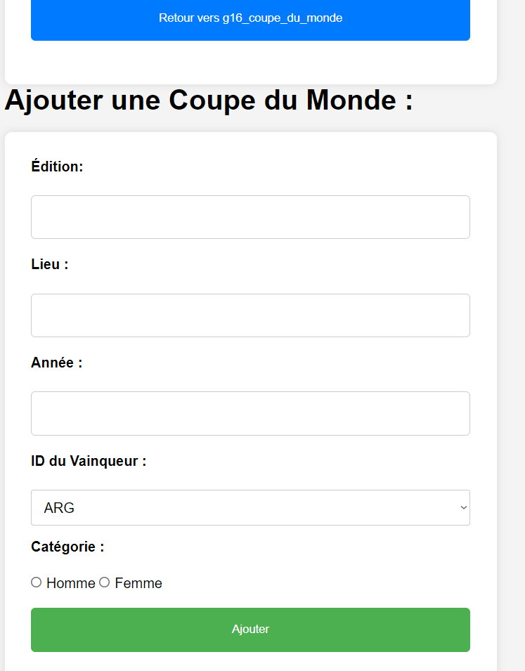

# Coupe du Monde - Gestion des Données

Ce projet est un système de gestion de données pour les Coupes du Monde, permettant de manipuler les informations sur les éditions, les pays participants et les organisateurs. Il utilise des formulaires HTML pour interagir avec une base de données et permet d'ajouter, de modifier et de visualiser des informations sur la Coupe du Monde.

## Fonctionnalités

- **Ajouter une Coupe du Monde** : Permet d'ajouter une nouvelle édition de la Coupe du Monde, incluant des détails tels que l'année, le lieu, et le pays vainqueur.
- **Modifier une Coupe du Monde** : Permet de modifier les informations d'une Coupe du Monde existante.
- **Gestion des pays** : Permet de modifier les détails des pays participants, comme le nom, la capitale et le continent.
- **Gestion des organisateurs** : Permet de modifier les informations relatives aux pays organisateurs d'une Coupe du Monde.

## Technologies utilisées

- **PHP** : Pour la gestion de la logique côté serveur et des interactions avec la base de données.
- **HTML** : Pour la structure et la mise en page des pages.
- **CSS** : Pour le design de l'interface.
- **MySQL** : Pour le stockage des données relatives aux Coupes du Monde, pays et organisateurs.

## Installation

### Prérequis

- Serveur web avec PHP supporté (par exemple, **XAMPP**, **WAMP**, **MAMP**, ou un serveur web Linux avec Apache et PHP).
- Serveur MySQL ou MariaDB.
- Un éditeur de code (par exemple **VS Code** ou **PHPStorm**).

### Étapes d'installation

1. **Cloner le repository** :
   Clone ce projet sur ton ordinateur en utilisant la commande suivante :
   ```bash
   git clone https://github.com/ton-utilisateur/ton-repository.git

## Images





